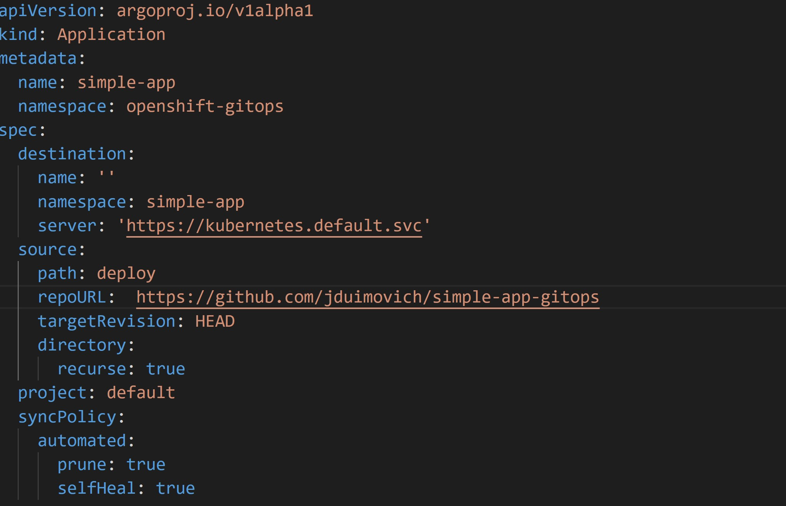
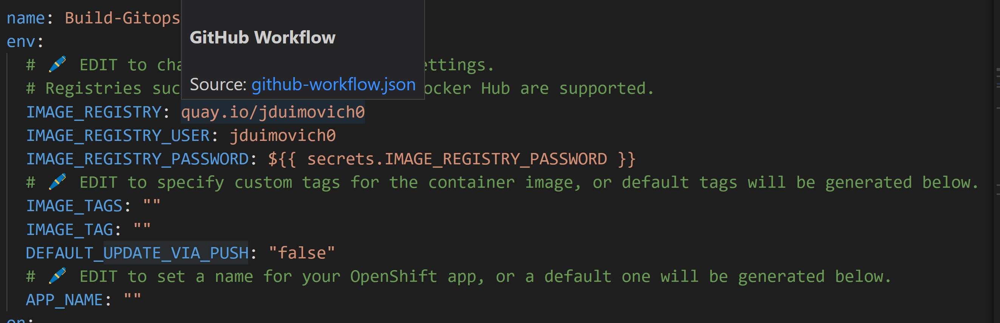

# Simple Container Based App  

## Build and Deploy a containerized app to OpenShift via Gitops.  

This demo shows a simple container based app can easily be bootstrapped onto an openshift cluster using Gitops.
This application runs a simple node.js server and serves up HTML pages. 

You need to install OpenShift Gitops on your cluster.

| Steps    |    |
| ----------- | ----------- |
| 1. Install OpenShift Gitops onto your cluster      |       |
| 2. Install the gitops app by modifiying the application in the `argo` directory  |          |
| 3. Fill in the details in the workflow. Each edit location is marked with  a  ⬇️ so you can easily find and configure the workflow.       | .    | 
| 4. Push your changes and watch it build. It will send a PR or a Push to this same repo and Gitops will deploy it.     |    .        |
 
 
